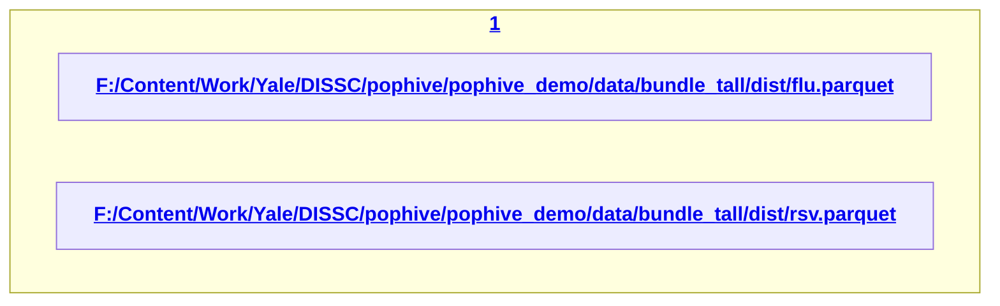

```mermaid
flowchart LR
    classDef pass stroke:#66bb6a
    classDef warn stroke:#ffa726
    classDef fail stroke:#f44336
    subgraph 1["`<strong><a href="https://github.com///tree/main/./1" target="_blank" rel="noreferrer">1</a></strong>`"]
        direction LR
        n1["`<strong><a href="https://github.com///blob/main/./1/dist/F:/Content/Work/Yale/DISSC/pophive/pophive_demo/data/bundle_tall/dist/flu.parquet" target="_blank" rel="noreferrer">F:/Content/Work/Yale/DISSC/pophive/pophive_demo/data/bundle_tall/dist/flu.parquet</a></strong>`"]
        n2["`<strong><a href="https://github.com///blob/main/./1/dist/F:/Content/Work/Yale/DISSC/pophive/pophive_demo/data/bundle_tall/dist/rsv.parquet" target="_blank" rel="noreferrer">F:/Content/Work/Yale/DISSC/pophive/pophive_demo/data/bundle_tall/dist/rsv.parquet</a></strong>`"]
    end
```
