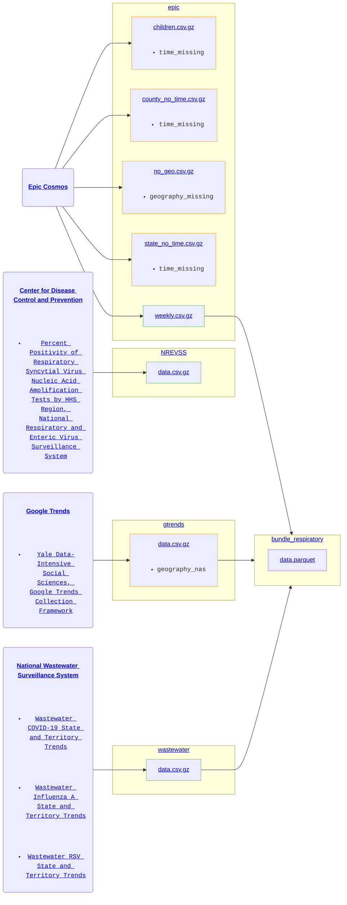

```mermaid
flowchart LR
    classDef pass stroke:#66bb6a
    classDef warn stroke:#ffa726
    classDef fail stroke:#f44336
    s0("`<h4><a href="https://cosmos.epic.com/" target="_blank" rel="noreferrer">Epic Cosmos</a></h4>`")
    s1("`<h4><a href="https://trends.google.com" target="_blank" rel="noreferrer">Google Trends</a></h4><br/><ul><br/><li><code><a href="https://github.com/DISSC-yale/gtrends_collection" target="_blank" rel="noreferrer">Yale Data-Intensive Social Sciences, Google Trends Collection Framework</a></code></li></ul>`")
    s2("`<h4><a href="https://data.cdc.gov" target="_blank" rel="noreferrer">Center for Disease Control and Prevention</a></h4><br/><ul><br/><li><code><a href="https://data.cdc.gov/resource/3cxc-4k8q" target="_blank" rel="noreferrer">Percent Positivity of Respiratory Syncytial Virus Nucleic Acid Amplification Tests by HHS Region, National Respiratory and Enteric Virus Surveillance System</a></code></li></ul>`")
    s3("`<h4><a href="https://www.cdc.gov/nwss" target="_blank" rel="noreferrer">National Wastewater Surveillance System</a></h4><br/><ul><br/><li><code><a href="https://www.cdc.gov/nwss/rv/COVID19-statetrend.html" target="_blank" rel="noreferrer">Wastewater COVID-19 State and Territory Trends</a></code></li></ul><br/><ul><br/><li><code><a href="https://www.cdc.gov/nwss/rv/InfluenzaA-statetrend.html" target="_blank" rel="noreferrer">Wastewater Influenza A State and Territory Trends</a></code></li></ul><br/><ul><br/><li><code><a href="https://www.cdc.gov/nwss/rv/RSV-statetrend.html" target="_blank" rel="noreferrer">Wastewater RSV State and Territory Trends</a></code></li></ul>`")
    subgraph epic["`<a href="https://github.com/dissc-yale/pophive_demo/tree/main/data/epic" target="_blank" rel="noreferrer">epic</a>`"]
        n1["`<a href="https://github.com/dissc-yale/pophive_demo/blob/main/data/epic/standard/children.csv.gz" target="_blank" rel="noreferrer">children.csv.gz</a><ul><br/><li><code>time_missing</code></li></ul>`"]:::warn
        n2["`<a href="https://github.com/dissc-yale/pophive_demo/blob/main/data/epic/standard/county_no_time.csv.gz" target="_blank" rel="noreferrer">county_no_time.csv.gz</a><ul><br/><li><code>time_missing</code></li></ul>`"]:::warn
        n3["`<a href="https://github.com/dissc-yale/pophive_demo/blob/main/data/epic/standard/no_geo.csv.gz" target="_blank" rel="noreferrer">no_geo.csv.gz</a><ul><br/><li><code>geography_missing</code></li></ul>`"]:::warn
        n4["`<a href="https://github.com/dissc-yale/pophive_demo/blob/main/data/epic/standard/state_no_time.csv.gz" target="_blank" rel="noreferrer">state_no_time.csv.gz</a><ul><br/><li><code>time_missing</code></li></ul>`"]:::warn
        n5["`<a href="https://github.com/dissc-yale/pophive_demo/blob/main/data/epic/standard/weekly.csv.gz" target="_blank" rel="noreferrer">weekly.csv.gz</a>`"]:::pass
    end
    subgraph gtrends["`<a href="https://github.com/dissc-yale/pophive_demo/tree/main/data/gtrends" target="_blank" rel="noreferrer">gtrends</a>`"]
        n6["`<a href="https://github.com/dissc-yale/pophive_demo/blob/main/data/gtrends/standard/data.csv.gz" target="_blank" rel="noreferrer">data.csv.gz</a><ul><br/><li><code>geography_nas</code></li></ul>`"]:::warn
    end
    subgraph NREVSS["`<a href="https://github.com/dissc-yale/pophive_demo/tree/main/data/NREVSS" target="_blank" rel="noreferrer">NREVSS</a>`"]
        n7["`<a href="https://github.com/dissc-yale/pophive_demo/blob/main/data/NREVSS/standard/data.csv.gz" target="_blank" rel="noreferrer">data.csv.gz</a>`"]:::pass
    end
    subgraph wastewater["`<a href="https://github.com/dissc-yale/pophive_demo/tree/main/data/wastewater" target="_blank" rel="noreferrer">wastewater</a>`"]
        n8["`<a href="https://github.com/dissc-yale/pophive_demo/blob/main/data/wastewater/standard/data.csv.gz" target="_blank" rel="noreferrer">data.csv.gz</a>`"]:::pass
    end
    subgraph bundle_respiratory["`<a href="https://github.com/dissc-yale/pophive_demo/tree/main/data/bundle_respiratory" target="_blank" rel="noreferrer">bundle_respiratory</a>`"]
        n9["`<a href="https://github.com/dissc-yale/pophive_demo/blob/main/data/bundle_respiratory/dist/data.parquet" target="_blank" rel="noreferrer">data.parquet</a>`"]
    end
    s0 --> n1
    s0 --> n2
    s0 --> n3
    s0 --> n4
    s0 --> n5
    s1 --> n6
    s2 --> n7
    s3 --> n8
    n5 --> bundle_respiratory
    n6 --> bundle_respiratory
    n8 --> bundle_respiratory
```
